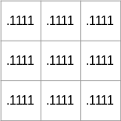

# Image Manipulation in Python

In this phase, we implement two image manipulation algorithms in Python to familiarize ourselves with the algorithms.

You will learn
* how images are represented in a computer system
* how colors and transparency are encoded
* what a convolution is
* how to blur an image using a _n_ x _n_ convolution
* how to alpha blend two images
* how to use fixed-point integer math

[[_TOC_]]


## Important Dates

| Date | Description |
|:---  |:--- |
| Wednesdday, March 29 | Handout |
| Sunday, April 9 | Submission deadline |

### Hand-out

Fork this repository into your namespace and set its visibility to private (this is the default). Read the instructions here carefully. Then clone the lab to your local computer and get to work.
If this is your first time using Git, our [minimal Git Howto](Git.md) will get you started.

### Submission

Commit and push your work frequently to avoid data loss. When you are ready to submit your code for grading, create a tag called "Submission". The timestamp of the "Submission" tag is considered your submission time.

To create a tag, visit the repository on GitLab and navigate to Repository -> Tags. Enter "Submission" as the Tag name then hit "Create tag". You can leave the other fields empty.

If you later discover an error and want to update your submission, you can delete the "Submission" tag, fix your solution, and create a new "Submission" tag. If that happens _after_ the submission deadline, you also need to email the TAs so that they are aware of the update to your submission.

### Coding Rules

In this lab, your work goes into the files `blur_float.py`, `blend_float.py`, `blur_int.py`, and `blend_int.py`. Imports of libraries or modules are not allowed, and you must not change the number of types of parameters passed to, or returned from the functions.

You can modify the other files of the handout to your liking. However, our grading system will only extract and evaluate the four files mentioned above.


## Image Manipulation

Image manipulation is an essential part of computer graphics and computer vision. It involves the process of transforming or altering digital images to achieve the desired outcome. In this handout, we introduce the basics of image representations and two common image manipulation techniques.

### Color representation

Digital images are represented using a grid of tiny elements called pixels. Each pixel contains color information, which is often represented using the [additive RGB (Red, Green, Blue) color model](https://en.wikipedia.org/wiki/RGB_color_model). An additional Alpha (A) channel can also be included to store transparency information.

In the RGB color model, each color channel can take on a value from 0 to 255, where 0 represents the minimum intensity and 255 the maximum intensity for that color. Combining these channels allows us to represent over 16 million distinct colors (256<sup>3</sup> = 16,777,216):

- Red (R): 0-255
- Green (G): 0-255
- Blue (B): 0-255

The number of colors that an average human can distinguish is estimated to be [around 10 million](https://en.wikipedia.org/wiki/Color_vision), so 16 million is sufficient to represent all colors we are able to recognize.

The following example shows the composition of a skyblue pixel in the RGB color model. Since each color is encoded in one byte, the three colors can be represented as a 24-bit hexadecimal number:


The Alpha channel, if present, represents the transparency level of a pixel, with 0 being fully transparent and 255 fully opaque:
- Alpha (A): 0-255  

The following illustration shows a gradient from fully transparent to completely opaque of the same skyblue color:


Putting it alltogether, here is how the a red, green, blue and alpha channel are composed to create a partially transparent image:


Note that intensities of the color channels and the opacity of the alpha channel are often normalized to a range from 0.00 to 1.00 to simplify the calculations (i.e., allowing the use floating point operations).


### Image Representation

In computer systems, images are typically stored in memory as a 3-dimensional array. For an image with dimensions WIDTH x HEIGHT x CHANNELS, the representative array would be

```C
image[HEIGHT][WIDTH][CHANNELS]
```

In other words, for each position in the image `image[y][x]`, one pixel composed of `CHANNEL` channels is stored.


### Image Blurring

Image blurring is an image processing technique that reduces noise, sharpness, and fine details in an image by smoothing out pixel values. This is typically achieved by applying a convolution operation, where the image is combined with a blurring kernel, also called a filter or mask, that determines the degree and pattern of the blur.

A blurring kernel is a small matrix of weights. An example of a 3x3 blurring kernel could be



This particular kernel shows a "Box Blur" (or mean blur, average blur) kernel where all weights are equal and add up to 1.

Blurring an image with a blurring kernel involves performing a convolution operation between the image and the kernel. During the convolution, the kernel is slid across the image, and for each position, a new pixel value is calculated by multiplying the kernel's weights with the corresponding image pixel values, followed by summing up the results.

The process is as follows:
1. Place the kernel's center weight on a pixel in the image.
1. Perform element-wise multiplication between the kernel's weights and the corresponding image pixel values.
1. Sum the results of the multiplication.
1. Replace the original pixel value in the output image with the calculated sum.

The following illustration explains the concept:


This process is repeated for each channel of the image (including the alpha channel, if present).

The following illustration shows a Box Blur of an image with different kernel sizes:


Note how the output image shrinks in size by $`k-1`$ pixels in width and height dimension, $`k`$ being the size of the $`kxk`$ kernel. This is usually avoided by enlarging the input image by $`k-1`$ pixels on each side before applying the convolution. To keep things simple, we do not consider such border conditions our implementation.

To summarize, image blurring can be expressed by the following pseudo-code:
```
  for all rows y
    for all columns x
      for all channels c
        output[y][x][c] = input[y-k-1..y+k-1][x-k-1..x+k-1][c] * kernel[1..k][1..k]
```
Certain adjustments will be necessary for this code to run, such as making sure the convolution does not exceed the borders of the image.


### Image Blending

Another frequently used image processing technique is image blending, which combines two or more images into a single composite image by applying blending factor to each input image. This process allows for the seamless merging of visual elements from multiple images or the creation of smooth transitions between them. During image blending, each pixel in the output image is calculated by taking a weighted combination of the corresponding pixels from the input images. The blending factor, typically ranging from 0 to 1, determines the contribution of each input image to the final output. By adjusting the blending factor, different visual effects can be achieved, such as transparency, overlays, or smooth transitions in image sequences or animations.

We distinguish two blending modes
* **Image merging**  
  In this mode, the images are blended together based on a global _alpha_ parameter. Since the original images can have transparency as well, the intensity of a pixel must first be multiplied by the alpha value of that pixel. Here is an example showing the blending of two images with a factor of $`alpha = 0.5`$. Note how the output image becomes transparent in areas where one of the original inputs is not fully opaque.  
    
  The merge operation can be implemented by
  ```
  for all rows y
    for all columns x
      output[y][x][A] = background[y][x][A]*(1 - alpha) + foreground[y][x][A]*alpha
      for channels c in R,B,G
        output[y][x][c] = background[y][x][c]*background[y][x][A]*(1 - alpha) + 
                        foreground[y][x][c]*foreground[y][x][A]*alpha
  ```

* **Image overlay**  
  In overlay mode, a foreground image is laid over a background image. In overlay mode, the color chanels are mixed with a per-pixel alpha value, which is defined as the product of the global alpha parameter and the alpha value of the foreground image. The alpha channel of the output pixel is identical to that of corresponding pixel in the background image.  
  The following example shows the result of an overlay operation with a global factor of $`alpha = 0.5`$.  
    
  The overlay operation can be implemented by
  ```
  for all rows y
    for all columns x
      output[y][x][A] = background[y][x][A]
      alpha_combined = foreground[y][x][A]*alpha
      for channels c in R,B,G
        output[y][x][c] = background[y][x][c]*(1 - alpha_combined) + 
                          foreground[y][x][c]*alpha_combined
  ```


## Your Task

Your task is to implement image blurring and image blending as described above. 

We implement two variants of each operation
* a (standard) floating point variant
* a (faster) fixed-point integer variant

The handout contains the skeletons for both manipulations and variants (`blur_float.py`, `blur_int.py`, `blend_float.py`, and `blend_int.py`). 

* **Floating-point code**  
  The the images store the intensities as 8-bit integers ranging from 0 to 255. You need to normalize all channels of a pixel by dividing the integer value by 255 before performing your calculations. The alpha parameter is provided as a float in the range 0.00 to 1.00, so you do not have to normalize it anymore.
* **Fixed-point code**  
  To avoid the expensive floating point operations, many image manipulation libraries offer a faster but slightly inaccurate fixed-point implementation.  
  In our fixed-point variant, we use 1.8 bit fixed-point values to represent a number range from 0.00000000<sub>2</sub> to 1.00000000<sub>2</sub>. To avoid expensive scaling operations, we interpret the 8-bit pixel values directly as 1.8-bit fixed-point numbers, yielding a range from 0.00000000<sub>2</sub> to 0.11111111<sub>2</sub>. Since the first bit is always zero, we can drop the leftmost bit and store the fixed-point values of a pixel in four 8-bit characters. Since we are unable to represent 1.0, we lose a little bit of intensity when calculating with fixed-point numbers. As a result, the result of the floating-point code and the integer fixed-point variant will not be bit-identical.
  When calculating with fixed-point numbers, remember what you have learned about fractional binary numbers, in particular, what happens to the radix point when multiplying numbers. Make sure to add/subtract only values that have the radix point in the same bit position and convert the number back to our .8-bit format before storing the values in the output pixel.


<div align="center" style="font-size: 1.75em;">

**Happy coding!**
</div>
